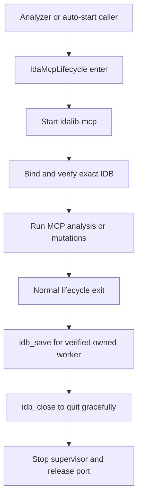

# idalib-mcp

## Overview

`idalib-mcp` is the repository-owned IDA runtime for one GoldSrc PE32/I386 or ELF32/I386 binary at a time. `IdaMcpLifecycle` starts, validates, saves, and closes the worker so an analysis task never binds an arbitrary or stale IDB.

## Responsibilities

- Start one owned `idalib-mcp` supervisor for the exact requested binary and wait for the MCP contract.
- Bind the unique active database, validate its path, platform metadata, architecture, and original-input hash.
- On successful lifecycle exit, save the verified owned IDB with `idb_save`, then request targeted `qexit`, stop the supervisor, and wait for port release.
- Fail closed for an existing IDB lock, occupied MCP port, ambiguous database, stale/mismatched IDB, or a failed explicit save.

## Involved Files & Symbols

- `ida_analyze_bin.py` - `IdaMcpLifecycle`, `_allocate_local_port`, `_create_ida_mcp_lifecycle`, `save_ida_database_via_mcp`, `quit_ida_gracefully`
- `agent_runner.py` - `mcp_endpoint_url`, `_agent_mcp_override_args`, endpoint-aware MCP preflight
- `ida_mcp_session.py` - `open_ida_mcp_session`, `McpDatabaseBinding.should_auto_quit`
- `generate_reference_yaml.py` - `autostart_mcp_session` for the reference-YAML CLI
- `tests/test_analysis_planner.py` - owned-save and graceful-shutdown contract tests

## Architecture

## Dependencies

- Local `idalib-mcp` executable. The analyzer allocates a free local port per binary lifecycle (`http://127.0.0.1:<dynamic-port>/mcp`) instead of pinning `13337`.
- IDA MCP tools including `idb_list`, `survey_binary`, `idb_save`, and `py_eval`.
- The target binary and its IDB side files; `.id0` denotes an active IDB lock.

## Notes

- Auto-save and automatic close apply only when `auto_started && owned && backend == "worker"`; an attached external database must never be saved or closed by this lifecycle.
- Call `idb_close` to release a worker eagerly.
- `idb_save` runs only on normal `IdaMcpLifecycle.__exit__`. If it fails, cleanup still performs graceful shutdown, then the lifecycle reports failure.
- Keep Windows and Linux work sequential; each lifecycle owns its allocated port, so a dynamic port no longer collides with an interactive `ida-pro-mcp` on `13337`. Do not start a second lifecycle against the same IDB lock.
- The verified runtime endpoint is injected into Agent fallback runs via invocation-scoped overrides (Claude `--mcp-config`, Codex `-c mcp_servers.*`, OpenCode `OPENCODE_CONFIG_CONTENT`); MCP preflight success is cached per agent/server/endpoint.
- Perform all IDB mutations inside the owned lifecycle. After validation, call `server_health`, then let normal lifecycle exit save and close the IDB. Verify the final IDB path and modification time after that exit; use manual `idb_save` only for an intermediate checkpoint.
- Do not create a pre-mutation backup IDB unless the user explicitly requests one.

## Callers

- `ida_analyze_bin.analyze` creates one lifecycle for each pending module/platform binary.
- `generate_reference_yaml.autostart_mcp_session` creates the same lifecycle for `-auto_start_mcp`.

## Persistent analysis client (issue #98)

- Trigger: five concurrent analysis workers repeatedly initialized MCP sessions between preprocessing, artifact validation and health checks; Windows loop construction also repeatedly created socketpairs.
- Root constraint: MCP/AnyIO transport contexts must be entered and exited by the same asyncio task, not merely the same loop. Caching an AsyncClient across repeated `asyncio.run()` calls is invalid.
- `mcp_worker_client.py:WorkerMcpClient` is owned by `IdaMcpLifecycle`. It runs one event loop and one serial owner task on a dedicated thread. `run_mcp_operation` routes synchronous analysis phases through the current lifecycle's ContextVar; outside an owned lifecycle it retains standalone `asyncio.run` behavior.
- `ida_mcp_session.open_ida_mcp_session` borrows the owned session within that task. Startup health and database binding share the raw session. HTTP limits are four total/two idle connections, with 15-second idle expiry. Each bound phase checks `idb_list` instance identity; each node's existing survey/hash checks remain enabled.
- Restart/rebuild invalidates the transport, binding and generation. Retained session objects reject a different loop/worker or expired generation. The lifecycle rebinds and runs the existing binary/platform/hash verification before returning a recovered runtime. No transport-layer mutation replay is introduced.
- Cleanup: save only when `save_on_success` permits it and the worker is owned/verified; `restored_strict` batch analysis retains no-save behavior. Graceful quit always retains a local process-tree stop fallback, then the client closes SDK contexts and joins its loop thread. Failed entry and cancellation also close the owner.
- Timeouts: loop bootstrap is bounded from the calling thread (10s), tools use 300s, phases default to 3600s, health recovery uses 30s, and client close uses 10s. An uninterruptible OS/Python call still requires the existing outer batch worker process timeout; Python cannot forcibly kill a stuck thread safely.
- Verification: `tests.test_ida_mcp_session` includes a real HTTP MCP fixture counting initialize and accepted TCP connections, instance replacement, changed hash on lifecycle restart, stale references/cross-loop rejection, disconnect without replay, cancellation, startup and operation timeouts, and thread cleanup. The 2026-09-09 five-way comparison completed 13/13 work items with the same 439-file contract digest; initialize calls fell from 1691 to 13, HTTP connection objects from 3440 to 26 (30 in the final repeat, still 13 initializations). TCP TIME_WAIT snapshots include other paths and are not proof of port exhaustion or resolution of the CI socketpair hang.
- Scope: GoldSrc client lifecycle; the separate ida-pro-mcp supervisor→worker RPC pool remains an independent fix. See [[full-analysis-concurrency]].
